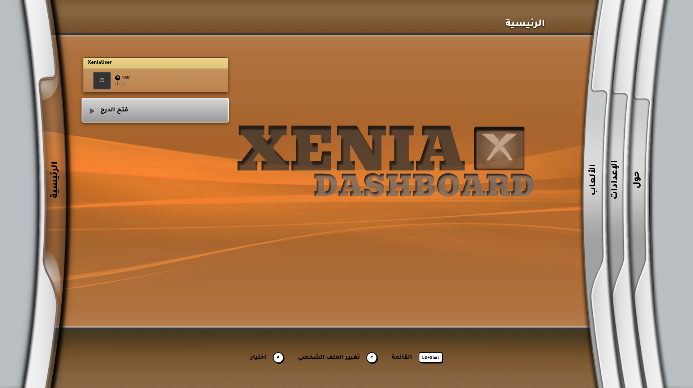
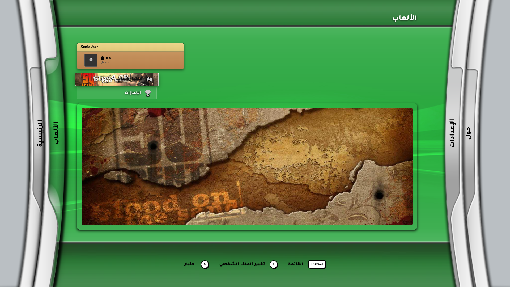
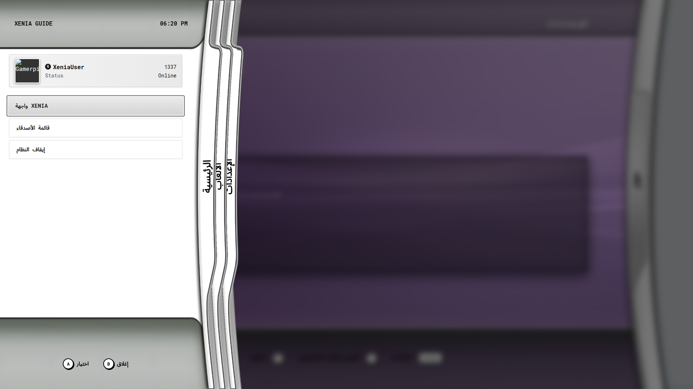
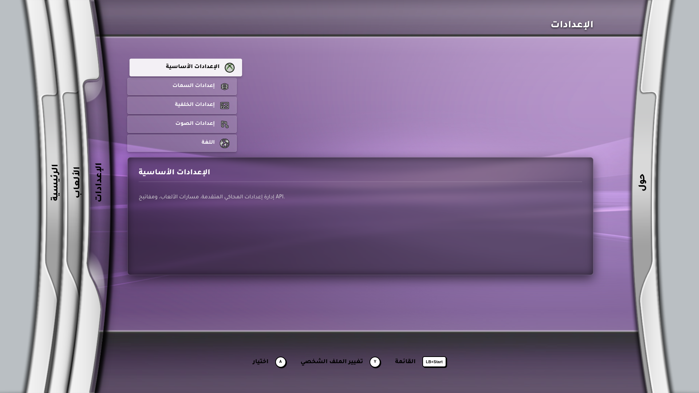

# Blades-2005 Theme for Xenia Dashboard
This project is an authentic, fan-made recreation of the classic 2005 Xbox 360 Blades interface, reimagined in a striking Gray-and-white color palette. Please note that this is an external theme extension specifically designed for the Xenia Dashboard program. It aims to completely transform your existing dashboard into the golden era of console interfaces.

  
  
   
  
  

 

---

## 📖 About The Project | عن المشروع

| English Description | الشرح باللغة العربية |
| :--- | ---: |
| **Welcome to the Blades-2005 Theme!**  This project is an authentic, fan-made recreation of the classic 2005 Xbox 360 Blades interface. Please note that this is an **external theme extension** specifically designed for the **Xenia Dashboard** program. It aims to completely transform your existing dashboard into the golden era of console interfaces. | 
**مرحباً بك في ثيم Blades-2005!**  هذا المشروع هو إعادة إحياء أصلية ومتقنة لواجهة Xbox 360 Blades الكلاسيكية (2005). للمعلومية، هذا المشروع عبارة عن **ثيم (Theme) منفصل وخارجي** مصمم خصيصاً لبرنامج **Xenia Dashboard**. يهدف الثيم إلى تحويل شكل البرنامج بالكامل ليعيدك إلى العصر الذهبي لواجهات أجهزة الألعاب.
 |

 

## ✨ Key Features | المميزات الرئيسية

| Features | المميزات |
| :--- | ---: |
| 🎨 **Distinctive Design:** Pixel-perfect Blades 2005 UI recreated in a strict, elegant black-and-white color palette with classic Xbox sounds.  🖌️ **Fully Customizable:** The system is highly flexible, allowing anyone to build, modify, and create their own custom interfaces exactly as they wish.  🎮 **Full Controller Support:** Seamless navigation using Gamepad or Keyboard.  📚 **Smart Library:** Auto-fetching of game metadata, covers, and backgrounds via SteamGridDB/LocalDB.  🏆 **Achievements Tracker:** Built-in system to track your Xbox 360 achievements with a beautiful split-pane UI.  ⚙️ **Advanced Configuration:** Per-game configuration, lightning-fast deep binary metadata scanning (via x360tid), and patch management.  🌍 **Localization:** Full support for multiple languages, including Right-to-Left (RTL) Arabic layout. | 
🎨 **تصميم مميز:** واجهة Blades 2005 مطابقة للأصل ومعاد تصميمها بنمط أبيض وأسود أنيق وصارم مع أصوات الإكس بوكس الكلاسيكية.  🖌️ **تخصيص كامل:** نظام مرن يتيح لأي شخص بناء، تعديل، وإنشاء واجهته الخاصة (Themes) وتخصيصها تماماً كما يريد.  🎮 **دعم كامل للتحكم:** تنقل سلس باستخدام ذراع التحكم (Gamepad) أو لوحة المفاتيح.  📚 **مكتبة ذكية:** جلب تلقائي لبيانات الألعاب، الأغلفة، والخلفيات عبر SteamGridDB أو LocalDB.  🏆 **متتبع الإنجازات:** نظام مدمج لتتبع جوائز Xbox 360 مع واجهة منقسمة (Split-pane) أنيقة.  ⚙️ **إعدادات متقدمة:** إعدادات مخصصة لكل لعبة، فحص سريع وعميق لملفات الألعاب (باستخدام أداة x360tid)، وإدارة الباتشات.  🌍 **تعدد اللغات:** دعم كامل للغات المتعددة، بما في ذلك التخطيط من اليمين لليسار (RTL) للغة العربية.
 |

## 🚀 Installation & Setup | التثبيت والإعداد

| How to Install | طريقة التثبيت |
| :--- | ---: |
| 1. Download the theme file from the Releases tab. 2. Extract the `Blades-2005` folder into the `systems` folder located inside your main **Xenia Dashboard** directory. 3. Launch the Xenia Dashboard program. 4. Go to **Settings > Themes**. 5. You will see the new theme there; select it to apply! | 
1. قم بتحميل ملف الثيم. 2. استخرج المجلد `Blades-2005` بداخل مجلد `systems` الموجود في مسار برنامج **Xenia Dashboard** الأساسي. 3. قم بتشغيل برنامج Xenia Dashboard. 4. اذهب إلى **الإعدادات (Settings) > الثيمات (Themes)**. 5. سوف يظهر الثيم الجديد هناك، قم باختياره لتفعيله فوراً!
 |

 

## 🕹️ Controls | التحكم

| Action | Keyboard | Gamepad | الإجراء بالعربية |
| :--- | :--- | :--- | ---: |
| **Navigate** | `Arrows` | `D-Pad` / `L-Stick` | 
التنقل بين العناصر
 |
| **Switch Blades (Pages)** | `Q` / `E` | `LT` / `RT` | 
التنقل بين الشفرات (الصفحات)
 |
| **Select / Enter** | `Enter` | `A` | 
اختيار / دخول
 |
| **Go Back** | `Esc` | `B` | 
رجوع
 |
| **Game Options / Refresh** | `Y` | `Y` | 
خيارات اللعبة / تحديث
 |
| **Patches / Delete**| `X` | `X` | 
الباتشات / حذف
 |
| **Open Guide** | `Tab` | `LB + Start` | 
فتح دليل الإكس بوكس (Guide)
 |
| **Virtual Keyboard**| `R3` | `R3` (Thumbstick) | 
فتح الكيبورد الافتراضي للبحث
 |

 

## 🛠️ Built With | التقنيات المستخدمة

| Technologies | التقنيات |
| :--- | ---: |
| - **[Electron](https://www.electronjs.org/):** Desktop framework. - **[Node.js](https://nodejs.org/):** Backend environment. - **[Alpine.js](https://alpinejs.dev/):** Lightweight UI reactivity. - **HTML5 & CSS3:** For the pixel-perfect black-and-white Blades UI styling. | 
- **Electron:** إطار عمل سطح المكتب. - **Node.js:** بيئة عمل الخلفية (Backend). - **Alpine.js:** للتعامل مع الواجهة التفاعلية بخفة. - **HTML5 & CSS3:** لتصميم واجهة Blades UI باللونين الأبيض والأسود بدقة عالية.
 |

 

---

  
<b>Disclaimer:</b> Xenia and Xenia Canary are trademarks of their respective authors. This project is a frontend created by the Xenia Dashboard developers and is not affiliated with Microsoft or the official Xenia development team.

  
<b>إخلاء مسؤولية:</b> Xenia و Xenia Canary هي علامات تجارية لأصحابها. هذا المشروع هو واجهة تشغيل خارجية من مطوري Xenia Dashboard وليس تابعاً لشركة Microsoft أو فريق تطوير Xenia الرسمي.

